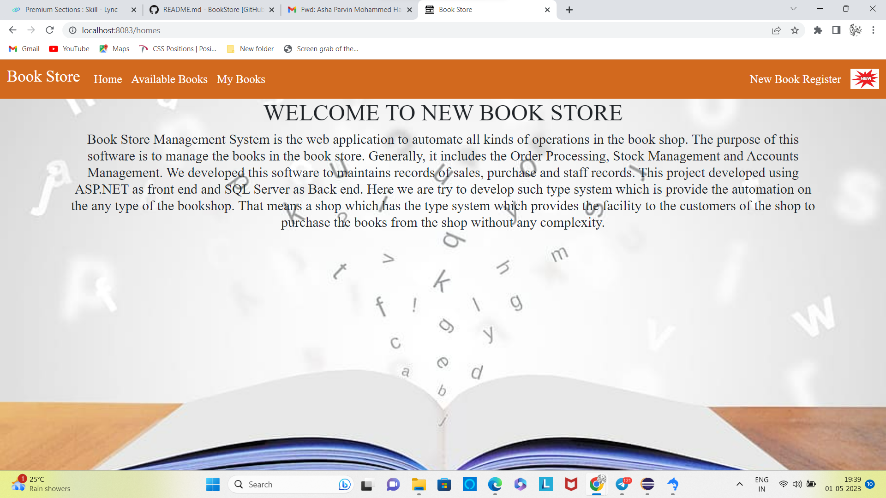
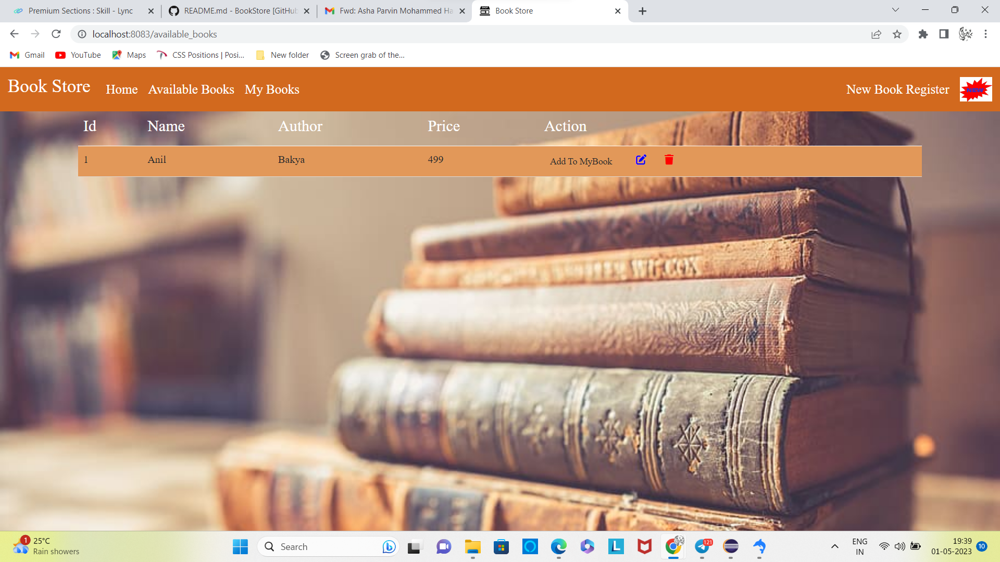
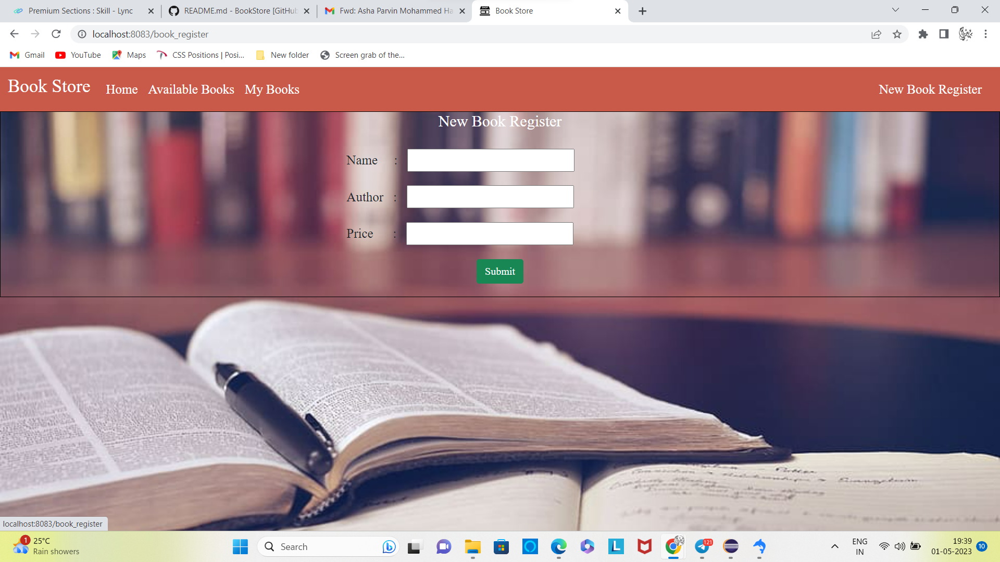
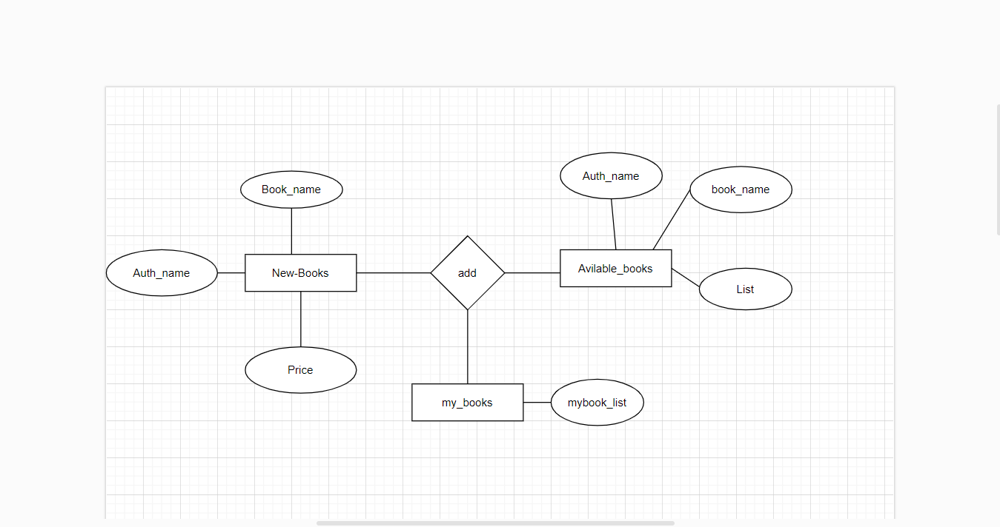

# BookStore SpringBoot 

# project-documentation

  

<h3 align="center">Home Page</h3>

## 📝 Table of Contents
- [About](#about)
- [Getting Started](#getting_started)
- [Deployment](#deployment)
- [Usage](#usage)
- [Flow Chart](#flowchart)
- [Contributing](../CONTRIBUTING.md)
- [Authors](#authors)
- [Acknowledgments](#acknowledgement)

## 🧐 About  
   A bookstore is a retail store that sells books and other printed materials. With the rise of e-books and digital publishing, many bookstores have expanded their offerings to include electronic formats as well. This project aims to build a web application for a bookstore using the Spring Boot framework.

## 🏁 Getting Started 
These instructions will get you a copy of the project up and running on your local machine for development and testing purposes.
1. Install Java: Spring Boot requires Java 8 or later to run. You can download and install the latest version of Java from the official website.

2. Install an IDE: You can use any Java IDE of your choice, such as Eclipse, IntelliJ IDEA, or NetBeans. Alternatively, you can use a text editor and build your project using the command line.

3. Create a new Spring Boot project: You can create a new Spring Boot project using Spring Initializr, which is a web-based tool for generating a new project structure. You can customize your project by selecting the required dependencies, such as Spring MVC, Spring Data, Spring Security, and more. You can download the generated project as a ZIP file or import it directly into your IDE.
                  https://start.spring.io/

4. Build and run your project: Once you have created your project, you can build and run it using your IDE or the command line. Spring Boot provides a built-in web server, so you can test your application by running it locally on your machine.

Spring Boot provides a wide range of features and tools for building modern, scalable, and maintainable web applications. With its auto-configuration, embedded web server, and opinionated approach to software design, Spring Boot makes it easy to get started with Java web development.

### Prerequisites

we have to install 
1. Java: Spring Boot requires Java 8 or later. You can download and install the latest version of Java from the official website.

2. IDE: You can use any Java IDE of your choice, such as Eclipse, IntelliJ IDEA, or NetBeans. Alternatively, you can use a text editor and build your project using the command line.

3. Database: If your application requires a database, you should have a database management system installed and configured. Spring Boot provides support for a wide range of databases, such as MySQL, PostgreSQL, Oracle, and MongoDB.

### Installing
To install Spring Boot for the backend, you need to follow these steps:

1. Download and install the latest version of Java from the official website.

2. Download and install a build tool such as Maven or Gradle.

  https://start.spring.io/

2. Install an IDE such as Eclipse, IntelliJ IDEA.

 https://www.eclipse.org/downloads/download.php?file=/oomph/epp/2023-03/R/eclipse-inst-jre-win64.exe

3. Create a new Spring Boot project using your build tool and IDE.

4. Add the necessary dependencies for your application, such as Spring MVC, Spring Data JPA, Spring Security, and others.

5. Build and package your application into a JAR file using your build tool.

Front-End:

HTML, Thymeleaf, CSS, Bootstrap.

## 🔧 Running the tests 

Running the project using the following commands:

1. By clicking "Run As" from "java application" for SpringBoot to start the project

2. By typing http://localhost:8083/homes

## 🎈 Usage 

1. Define the necessary dependencies for our project in the pom.xml file (if you're using Maven) or build.gradle (if you're using Gradle). Some of the dependencies we'll need for a basic bookstore project are:

Spring Web: to handle HTTP requests and responses
Spring Data JPA: to interact with a relational database like MySQL or PostgreSQL
Thymeleaf: to render HTML templates
Spring Security: to manage user authentication and authorization
Stripe: to process credit card payments
Define your application's database schema using JPA entities and repositories. For example, you might have an Order entity, a Book entity, and a Customer entity.

2. Write unit tests for our application's controllers, services, and repositories using a testing framework like JUnit.

3. Configure your application's properties, such as the database URL and credentials, using a configuration file like application.properties or application.yml.

4. Build and package your application into a deployable artifact, such as a JAR or WAR file.

5. Deploy our application to a web server like Apache Tomcat or run it as a standalone application.

## 🚀 Deployment 
To deploy the application to a production environment, follow these steps:

1. Ensure that you have installed the required dependencies and have configured the necessary environment variables, such as the database connection details and any API keys or secrets(facebook).

2. Start the application by running "java application" from Run As for the backend.

3. Copy the built application to the server or hosting environment where you want to deploy the application.

4. Start the application by running "npm run dev" for the frontend.

5. Application is accessible from the internet by configuring http://localhost:8083/homes

6. Monitor the application for any errors or issues, and make any necessary updates or patches as needed.

 <h3><b>Homepage</b></h3> 
      
 <h3><b>Availble Books Page</b></h3> 
     
 <h3><b>My Books Page</b></h3> 
      
 <h3><b>New Register Book Page</b></h3> 
     
 
## ⛏ Flow Chart 

  

## ✍️ Authors 
- [@SkillLymc] - FSD

## 🎉 Acknowledgements 
I would like to thank the following individuals for their contributions to this project:

- The team at Skill-Lync, for generously providing the data used in this project.

- References:

  https://www.codejava.net/frameworks/spring-boot
 